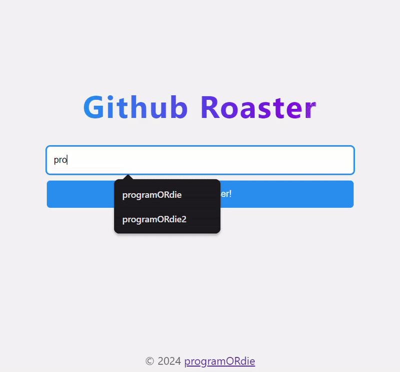

# 🚀 AI GitHub Project Suggestions

> An intelligent project advisor powered by Google Gemini AI that analyzes GitHub profiles and recommends personalized project ideas to accelerate developer growth.

## ✨ Features

- 🔍 **Profile Analysis**: Automatically fetches and analyzes GitHub user profiles, repositories, and README files
- 🤖 **AI-Powered Recommendations**: Leverages Google's Gemini AI to generate personalized project suggestions
- 🎯 **Skill-Based Matching**: Suggests projects aligned with current skills and growth opportunities
- ⚡ **Edge Computing**: Built on Cloudflare Workers for ultra-fast global performance
- 🎨 **Clean UI**: Simple, intuitive interface for seamless user experience

## 🌐 Live Demo

[⭐ Try it now!](https://github-roaster.programordie.workers.dev/)



## 🛠️ Tech Stack

- **Runtime**: [Cloudflare Workers](https://workers.cloudflare.com/)
- **Language**: TypeScript
- **AI Model**: Google Gemini API
- **Bundler**: Wrangler
- **Testing**: Vitest

## 📋 Prerequisites

Before you begin, ensure you have:

- [Node.js](https://nodejs.org/) (v16 or higher)
- [npm](https://www.npmjs.com/) or [pnpm](https://pnpm.io/)
- A [Google AI Studio](https://makersuite.google.com/app/apikey) account for Gemini API access

## 🚀 Getting Started

### 1️⃣ Get Your Gemini API Key

1. Visit [Google AI Studio](https://makersuite.google.com/app/apikey)
2. Sign in with your Google account
3. Click **"Get API Key"** or **"Create API Key"**
4. Copy your API key for later use

### 2️⃣ Installation

Clone the repository and install dependencies:

```bash
# Clone the repository
git clone https://github.com/kiganyamburu/Project-Suggestion.git
cd Project-Suggestion

# Install dependencies
npm install

# Install Wrangler CLI (if not already installed)
npm install -g wrangler
```

### 3️⃣ Configuration

#### For Local Development

Create a `.dev.vars` file in the project root:

```bash
GEMINI_API_KEY=your-api-key-here
```

#### For Production Deployment

Set your API key as a Cloudflare secret:

```bash
npx wrangler secret put GEMINI_API_KEY
# Paste your API key when prompted
```

### 4️⃣ Running Locally

Start the development server:

```bash
npm run dev
# or
npx wrangler dev
```

Open your browser and navigate to the URL shown in the terminal (typically `http://localhost:8787`).

### 5️⃣ Deployment

Deploy to Cloudflare Workers:

```bash
npm run deploy
# or
npx wrangler deploy
```

Your project will be live on Cloudflare's global network! 🎉

## 📖 How It Works

1. **User Input**: Enter a GitHub username in the web interface
2. **Data Collection**: The worker fetches:
   - User profile information
   - Recent public repositories (prioritizing non-forked repos)
   - Profile README (if available)
3. **AI Analysis**: Gemini AI analyzes the data and generates:
   - 3-5 personalized project ideas
   - Skill development opportunities
   - Growth recommendations
4. **Results**: Tailored suggestions are displayed with:
   - Project titles
   - Detailed descriptions
   - Skills to learn
   - Rationale for each suggestion

## 🧪 Testing

Run tests with Vitest:

```bash
npm test
```

## 📁 Project Structure

```
github-roaster-master/
├── src/
│   ├── index.ts          # Main worker logic
│   ├── index.html        # Frontend UI
│   └── types.d.ts        # TypeScript definitions
├── test/
│   └── index.spec.ts     # Test files
├── wrangler.toml         # Cloudflare Workers config
├── package.json          # Project dependencies
├── tsconfig.json         # TypeScript config
└── README.md            # This file
```

## 🔧 Available Scripts

| Script               | Description                       |
| -------------------- | --------------------------------- |
| `npm run dev`        | Start local development server    |
| `npm run deploy`     | Deploy to Cloudflare Workers      |
| `npm test`           | Run test suite                    |
| `npm run cf-typegen` | Generate Cloudflare Workers types |

## 🤝 Contributing

Contributions are welcome! Please feel free to submit a Pull Request.

1. Fork the repository
2. Create your feature branch (`git checkout -b feature/AmazingFeature`)
3. Commit your changes (`git commit -m 'Add some AmazingFeature'`)
4. Push to the branch (`git push origin feature/AmazingFeature`)
5. Open a Pull Request

## 📝 License

This project is open source and available under the [MIT License](LICENSE).

## 🙏 Acknowledgments

- [Google Gemini AI](https://ai.google.dev/) for powering the AI recommendations
- [Cloudflare Workers](https://workers.cloudflare.com/) for the serverless platform
- [GitHub API](https://docs.github.com/en/rest) for profile data access

## 📧 Contact

Project Link: [https://github.com/kiganyamburu/Project-Suggestion](https://github.com/kiganyamburu/Project-Suggestion)

---

<p align="center">Made by P.K. Mburu</p>
